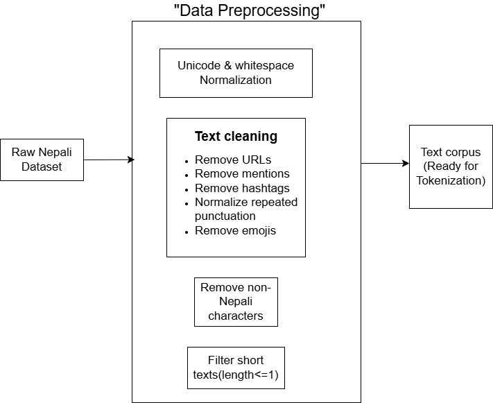
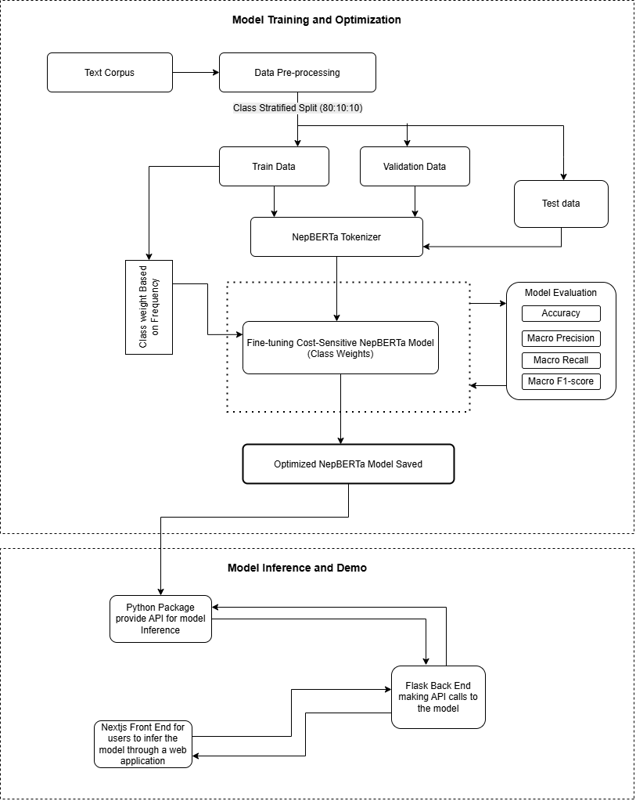

# Nepali Hate Text Detection using NepBERTa

## Overview

This project is a deep learning-based Nepali hate speech detection system built using the **NepBERTa** transformer model. The system classifies Nepali text as **Hate Speech** or **Non-Hate Speech** and masks offensive words to reduce the spread of harmful content.

The project was developed as a research-based NLP application for automatic hate speech detection in the Nepali language.

## Features

* Hate speech classification for Nepali text
* Fine-tuned NepBERTa transformer model
* Automatic text preprocessing
* Offensive word masking
* Interactive web application

## System Workflow

1. User enters Nepali text.
2. The text is preprocessed by removing URLs, emojis, special characters, and unnecessary whitespace.
3. The cleaned text is tokenized using the SentencePiece tokenizer.
4. The fine-tuned NepBERTa model predicts whether the text is Hate or Non-Hate.
5. If hate speech is detected, offensive words are masked before displaying the result.

## Dataset

* Total samples: **39,830**
* Language: **Nepali (Devanagari)**
* Classes:

  * Hate Speech (1)
  * Non-Hate Speech (0)

The dataset was created by combining publicly available Nepali hate speech datasets and additional labeled samples.

## Data Preprocessing

The preprocessing pipeline includes:

* URL removal
* Emoji removal
* Special character removal
* Hashtag and mention removal
* Whitespace normalization
* Nepali spelling normalization

---

## Model

* Base Model: **NepBERTa**
* Tokenizer: **SentencePiece**
* Optimizer: **AdamW**
* Learning Rate: **1e-5**
* Batch Size: **16**
* Epochs: **5**
* Weight Decay: **0.01**

## Results

The system predicts whether the input text contains hate speech.

Output:

* Hate Speech
* Non-Hate Speech

If hate speech is detected, offensive words are masked before displaying the output.

## Future Improvements

* Multi-class hate speech classification
* Explainable AI (XAI) support
* Real-time social media monitoring
* REST API deployment
* Larger Nepali hate speech dataset

## Technologies Used

* Python
* PyTorch
* Hugging Face Transformers
* NepBERTa
* SentencePiece
* FASTAPI

